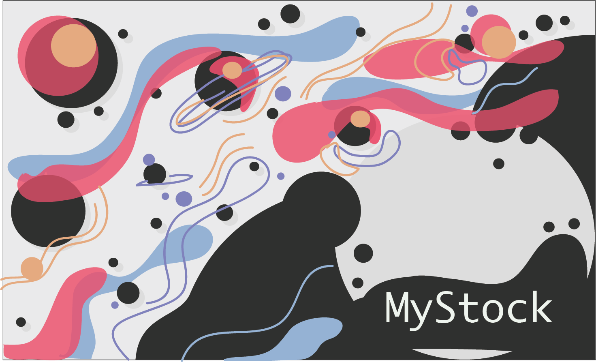

<div align="center" style="margin: 2rem 0;">

# MyStock
</div>

MyStock is an application where you can create an inventory for your products to help you manage your stocks. To use it you need to create an account first and then you can log in, once logged in you can create new collections and add items to your collections. [Take a look](https://inventoryapp-2.herokuapp.com/).


<br>
<br>
<br>
<br>

# Introduction

This application has been built using Express for Node.js. Endpoints render using Express' rounting and handlebars for the views. Bcryptjs is used for password encrypting. When it comes to storing images the Cloudinary services were used. To make the user's session persisten express session  was used to store sessions when the user logs in. In case the user forgets their password the Nodemailer package was implemented to send the user an e-mail to help regain access to the application. The user also has the option to loging with Google using passport with Passport Google Oauth20 for authentication.

<br>
<br>

## Prerequisites

Make sure you have node installed. You can use the following command and if installed, you will get its version.

```bash
node -v
```

<br>

## Dependencies

- @sendgrid/mail
- bcryptjs
- cloudinary
- connect-mongo
- cookie-parser
- dotenv
- express
- express-session,
- hbs
- mongoose
- morgan
- multer
- multer-storage-cloudinary
- nodemailer
- passport
- passport-google-oauth20
- serve-favicon

<br>

If you are missing any of the dependencies above, run: yarn add **name-of-dependency**. For instance, to add **bcryptjs** the command would be:

```bash
npm install add bcryptjs
```

<br>

## Scripts

Use npm run dev to get the application running.

```sh
npm run dev
```

<br>
<br>

# Pages
In this section you can learn about the different pages the application has. For all pages the Base URL is: `https://inventoryapp-2.herokuapp.com`

<br>
<br>

Page                | URL                   | Description       | Auth required      |
|-------------------|-----------------------|-------------------|:------------------:|
Landing             | /                     | Landing           | 
Log in              | /login                | Log in            |
Sign up             | /signup               | Sign up           |
Home                | /home                 | Home              | ✔️
Collections         | /collection           | Collections       | ✔️
Items               | /items                | Items             | ✔️
User's profile      | /user-profile         | Manage user info  | ✔️
Edit password       | /edit-pass            | Change password   | ✔️

<br>
<br>

# Credits
This application was developed by [Eva Alonzo](https://github.com/EvaAlonzo) & Luis Bermudez.